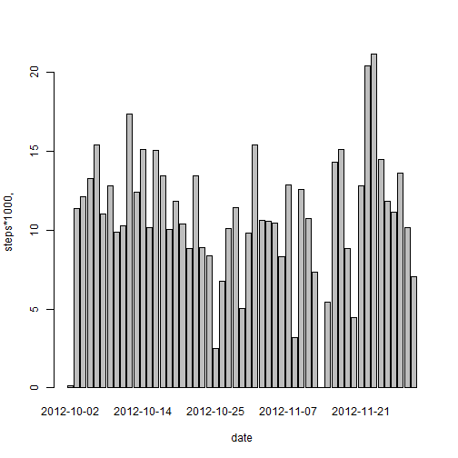
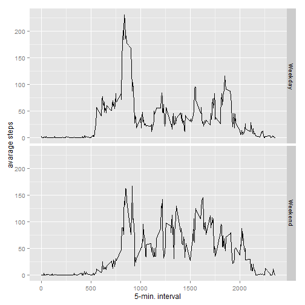

# Project assignment #1


Loading the nesessary libraries


```r
library(lattice)
library(ggplot2)
```


Reading the data


```r
Data <- read.csv('activity.csv')
Data$date<-as.Date(Data$date)
```


## Part 1: Calculating the mean total number of steps taken per day

Aggregating the data:

```r
total.steps <- aggregate(steps ~ date, data = Data, FUN = sum)
```

Building a barplot

```r
barplot(total.steps$steps/1000, names.arg = total.steps$date, xlab = "date", ylab = "steps*1000,")
```

 

Here is the mean total number of steps taken per day:

```r
mean(total.steps$steps)
```

```
## [1] 10766.19
```

Here is the median total number of steps taken per day:

```r
median(total.steps$steps)
```

```
## [1] 10765
```


## Part 2: calculating the average daily activity pattern:

Aggregating the data and building a plot:

```r
activity.pattern <- aggregate(steps ~ interval, data = Data, FUN = mean)


plot(activity.pattern, type = "l")
```

 

Here is the 5-minute interval that contains the maximum number of steps on average across all the days in the dataset:

```r
activity.pattern$interval[which.max(activity.pattern$steps)]
```

```
## [1] 835
```


##Part3: Imputing missing values

Here is the number of missed values for the "steps" variable:

```r
incomplete <- sum(!complete.cases(Data$steps))
```

The strategy for the missing values will be just simply add the average number of steps for this specific interval. (Please note that the averag number of steps are calulated above, so we just need to match missin values properly!)


```r
Complete.Data <- transform(Data, steps = ifelse(is.na(Data$steps), activity.pattern$steps[match(Data$interval, activity.pattern$interval)], Data$steps))
```

Aggregating the updated data (with no missing values):

```r
complete.total.steps <- aggregate(steps ~ date, data = Complete.Data, FUN = sum)
```

Plotting a new "complete" data:

```r
barplot(complete.total.steps$steps, names.arg = complete.total.steps$date, xlab = "date", ylab = "steps")
```

 

Calculating the mean for the "complete" data:

```r
mean(complete.total.steps$steps)
```

```
## [1] 10766.19
```

Calculating the median for the "complete" data:

```r
median(complete.total.steps$steps)
```

```
## [1] 10766.19
```


#Part 4: Reseaching the differences in activity patterns between weekdays and weekends.

Defining the weekdays:

```r
weekdays <- c("Monday", "Tuesday", "Wednesday", "Thursday", "Friday")
```


Adding new variable - "daytype" - which defines the type of the day in the week:

```r
Complete.Data$daytype = as.factor(ifelse(is.element(weekdays(as.Date(Complete.Data$date)),weekdays), "Weekday", "Weekend"))
```

Aggregating the data for further plotting:

```r
actyvity.pattern.daytype <- aggregate(steps ~ interval + daytype, Complete.Data, mean)
```

Building a weekend/weekday comparison plots:

```r
ggplot(actyvity.pattern.daytype, aes(interval, steps)) + 
    geom_line() + 
    facet_grid(daytype ~ .) +
    xlab("5-min. interval") + 
    ylab("avarage steps")
```

 
